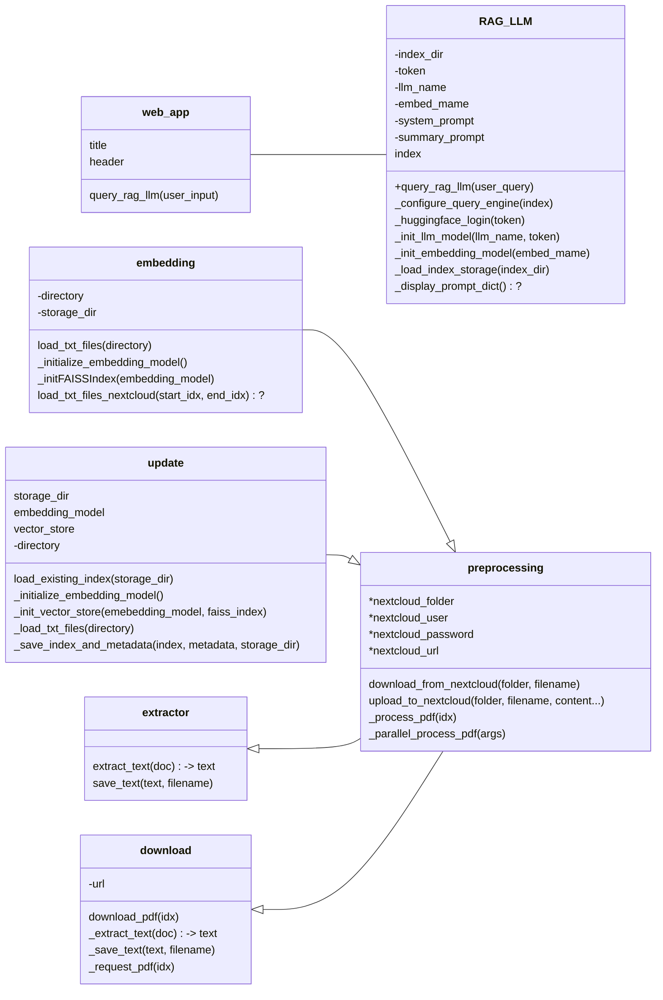

# hackathon-council-analytics

Heidelberg City Council automatic document processing, analyzing and chatbot.

## Table of Contents

- [hackathon-council-analytics](#hackathon-council-analytics)
  - [Table of Contents](#table-of-contents)
  - [About](#about)
  - [Development](#development)
    - [Prerequisites](#prerequisites)
    - [Installation](#installation)
      - [Change Directory](#change-directory)
      - [Cloning The GitHub Repository](#cloning-the-github-repository)
      - [Create Virtual Environment - Optional](#create-virtual-environment---optional)
      - [Installing Packages](#installing-packages)
      - [Programm Structure](#programm-structure)
  - [Community](#community)
    - [Contribution](#contribution)
    - [Branches](#branches)
  - [FAQ](#faq)
  - [Resources](#resources)
  - [Credit/Acknowledgment](#creditacknowledgment)
  - [License](#license)

## About
This project intends to automatically download hundreds of thousand of publicly available documents from Heidelberg City Council's website regularly and transform them by indexation and vectorization before finally run data analytics models against them using NLP and LLM. The purpose is to create a democratic trusted system whereby all stakeholders will be able to search, analyze and get answer to their questions quickly and transparently.

## Quick Start

A full version of the Chatbot including all required software components is available as docker image. 
Only two components have to be added manually: 
1. A vector database with publically available, embedded documents of Heidelberg City Council can be downloaded [from Nextcloud](https://nc.openheidelberg.de/s/WfoDMTiqqeT6eg2).
2. Two personalized configuration files, namely ``config.toml`` and ``secrets.toml`` which are based on [``config_sample.toml``](https://github.com/Open-Community-Building/hackathon-council-analytics/blob/main/src/config_sample.toml) and [``secrets_sample.toml``](https://github.com/Open-Community-Building/hackathon-council-analytics/blob/main/src/secrets_sample.toml). The scripts search for it in directory `` /root/.config/hca/``. Otherwise, the external volumes of the service *hca* in ``docker-compose.yml`` have to be adjusted. 

After linking the docker image to the configuration settings, the container can be build by first pulling the exsting image and second execute the docker compose: 

```
docker pull chrisbtt/council-analytics:latest
```
```
docker compose up -d
```

This procedure will open up a port for the ChatBot: *https://localhost:8501*. 

For code development, the docker image can also be build from source including new adjustments instead of pulling from Docker Hub: 
```
docker build . -t local/council-analytics
```
The filename has to be adjusted in ``docker-compose.yml`` at *service:hca:image*


## Development

### Prerequisites
Before installing required packages/libraries make sure the following prerequisites on your development machine or virtual environment (Recommended) are satisfied. A Python Virtual Environment is an isolated directory with a particular file structure where you can work on your Python projects, separately from your global-installed Python.

There are many variations of virtual env packages/tools, that allows you to create virtual environments such as [Pipenv & Virtual Environments](https://docs.python-guide.org/dev/virtualenvs/), [Managing Environments with Conda](https://docs.conda.io/projects/conda/en/latest/user-guide/tasks/manage-environments.html) but you can start with the [Python docs on Virtual Environments](https://docs.python.org/3/tutorial/venv.html) if you are not familiar or using one yet.

* Git - [Download & Install Git](https://git-scm.com/downloads). OSX and Linux machines typically have this already installed.
* Python - [Download & Install Python 3.11.10](https://www.python.org/downloads/release/python-31110/).
* Hard Drive Space - You need between 3GB to 4GB of free hard drive space for this project.

### Installation

Once you've followed all the steps in the prerequisites, you're just a few steps away from starting to develop and contribute to this project.

This project comes with a file called requirements.txt which contains the list of all required packages with their corresponding version number you need to start this project.

#### Change Directory

From command-line terminal change directory where you would like to save this project on your machine.

e.g. with Windows command-line

```
$ ~ > cd Open-Community-Building
```

#### Cloning The GitHub Repository

From command-line terminal within the directory for your project, clone the project with git command below.

```
$ git clone https://github.com/Open-Community-Building/hackathon-council-analytics.git
```

#### Create Virtual Environment - Optional

- Change directory to the root folder of the cloned project.
- Make sure to be created virtual environment points to correct version of the python on your machine.
- Run the command to create the virtual environment.

Please follow the virtual environment creation links above for the detailed instructions. 

e.g. on Windows machine with Pipenv (To work with Pipenv you need first to install the package globally on your system with command: pip install pipenv)

```
$ ~ \Open-Community-Building\hackathon-council-analytics pipenv shell --python path\to\your\python\python.exe
```

#### Installing Packages

Run below command within the root folder of the cloned project to install the required packages listed in requirements.txt file.

e.g. 1- If you are using global environment.

```
$ pip install -r requirements.txt
```

e.g. 2- If you are using virtual environment with pipenv. Please note pipenv will create Profile and Profile.lock files for package and dependency management.

```
$ pipenv install -r requirements.txt
```

#### Programm Structure


## Community

 ### Contribution

 Your contributions are always welcome and appreciated. Following are the things you can do to contribute to this project.

 1. **Report a bug** <br>
 If you think you have encountered a bug, and we should know about it, feel free to report it [here](https://github.com/Open-Community-Building/hackathon-council-analytics/issues) and I will take care of it.

 2. **Request a feature** <br>
 You can also request for a feature [here](), and if it will viable, it will be picked for development.  

 3. **Create a pull request** <br>
 It can't get better then this, your pull request will be appreciated by the community. You can get started by picking up any open issues from [here]() and make a pull request.

 > If you are new to open-source, make sure to check read more about it [here]() and learn more about creating a pull request [here]).


 ### Branches

 Version is frequently updated.

1. **`devel_hanna_schmidt`** or **`feat_optimize_data_analysis`** are example of a developer or feature branches.

2. **`main`** is the master branch.

3. You can create a developer or feature branches but they should get merged with the master/main branch.

**Steps to work with developer or feature branch**

1. To start working on a developer branch, create a new branch prefixed with `devel`, followed by developer first name followed by an underscore (**`_`**) and and finally developer surname (ie. `devel_hanna_schmidt`)
2. To start working on a new feature branch, create a new branch prefixed with `feat`, followed by an underscore (**`_`**) and and finally followed by feature name. (`feat_FEATURE_NAME`)
3. Once you are done with your changes, you can raise PR.

**Steps to create a pull request**

1. Make a PR request.
2. Comply with the best practices and guidelines.

After this, changes will be merged.


## FAQ


## Resources


## Credit/Acknowledgment


## License
